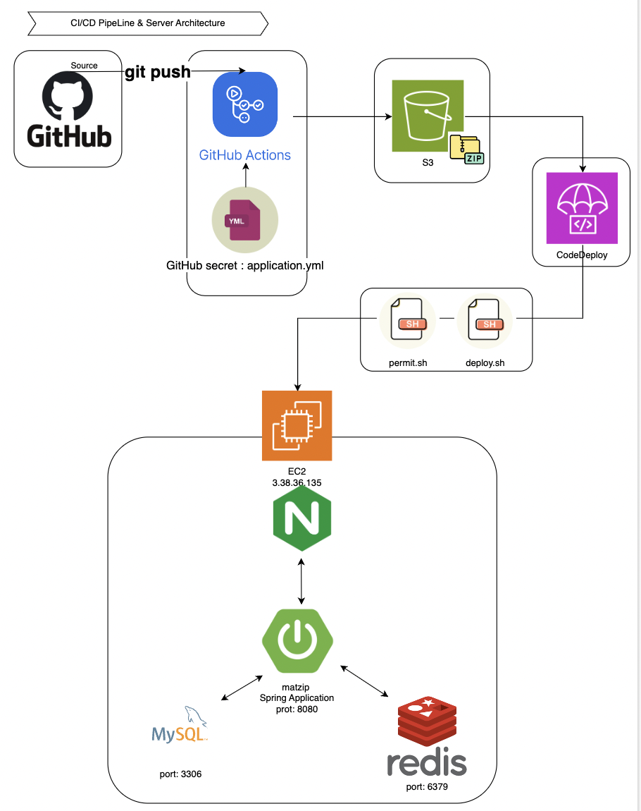
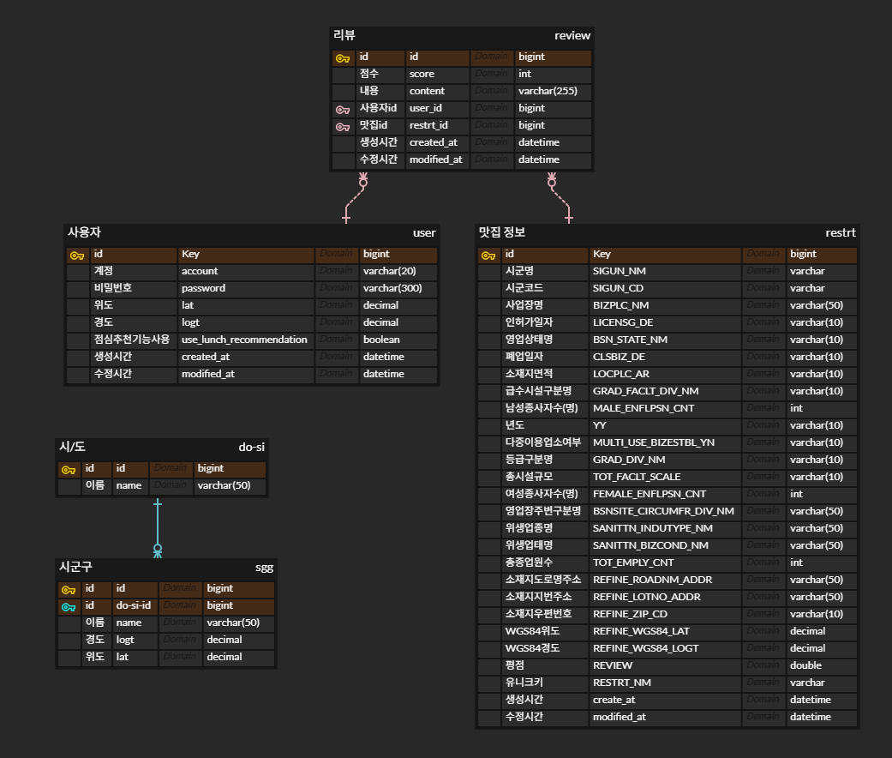

# matzip_rec
본 서비스는 공공 데이터를 활용하여, 지역 음식점 목록을 자동으로 업데이트 하고 이를 활용합니다. 사용자 위치에 맞게 맛집 및 메뉴를 추천하여 더 나은 다양한 음식 경험을 제공하고, 음식을 좋아하는 사람들 간의 소통과 공유를 촉진하려 합니다.

## 목차
>1. [개발기간](#개발기간)
>2. [시나리오](#시나리오)
>3. [기술 스택](#기술-스택)
>4. [아키텍처](#아키텍처)
>5. [데이터베이스 모델링](#데이터베이스-모델링)
>6. [API 명세](#api-명세)
>7. [구현 기능](#구현-기능)
>8. [트러블 슈팅](#트러블-슈팅)
>9. [프로젝트 진행 및 이슈 관리](#프로젝트-진행-및-이슈-관리)
>10. [팀원 소개](#팀원-소개-및-역할)

 

## 개발기간
**2024.08.27 ~ 2024.09.02 (7일)**

 

## 시나리오
- 유저는 본 사이트에 들어와 회원가입 및 내 위치를 지정한다.
- **A. 내 위치 기반 맛집추천 = (`내 주변보기`)**
  - `도보` 기준 `1km` 이내의 맛집을 추천한다.
  - `교통수단` 기준 `5km` 이내의 맛집을 추천한다.
- **B. 지역명 기준 맛집추천(`특정 지역 보기`)**
  - 지정한 `지명(시군구)` 중심위치 기준 `10km` 이내의 맛집을 추천한다.
- A, B를 다양한 검색기준 (정렬, 필터링 등)으로 조회 가능하며 (`거리순`, `평점순` , `양식`, `중식`)
- 해당 맛집의 상세정보를 확인할 수 있다.

 

## 기술 스택

**언어 및 프레임워크** : 

**데이터 베이스** : 

**배포** :
 

**ETC** : 

 

## 아키텍처

    
<b>아키텍처</b>

    

 

## 데이터베이스 모델링

  
<b>데이터베이스 모델링</b>

    

 

## API 명세

### 🖥 swagger 문서 
배포 경로: [http://3.38.36.135:8080/api/swagger-ui/index.html](http://3.38.36.135:8080/api/swagger-ui/index.html#/) 
localhost: [http://localhost:8080/api/swagger-ui/index.html](http://localhost:8080/api/swagger-ui/index.html#/)

| **분류** | **API 명칭** | **HTTP 메서드** | **엔드포인트** | **설명** |
| --- | --- | --- | --- | --- |
| **인증&인가** | 사용자 회원가입 | POST | /api/signup | 사용자는 계정명, 비밀번호로 회원가입합니다. |
|  | 사용자 로그인 | POST | /api/login | 사용자는 계정명, 비밀번호로 로그인합니다. 로그인 시 쿠키, 헤더에 Refresh Token, Access Token이 발급됩니다. |
|  | 토큰 재발급 | POST | /api/reissue | 유효한 Refresh Token으로 Access Token, Refresh Token을 재발급합니다. |
| **사용자** | 사용자 정보 조회 | GET | /api/users/{userId} | 패스워드를 제외한 사용자 정보를 반환합니다. 사용자 위치, 점심 추천 기능 사용 여부 등을 활용할 수 있습니다. |
|  | 사용자 위치 업데이트 | PATCH | /api/users/{userId}/location | 사용자의 위치(위도, 경도)를 업데이트합니다. |
|  | 점심 추천 기능 사용 여부 업데이트 | PATCH | /api/users/{userId}/lunchRecommendation | 사용자의 점심 추천 기능 사용 여부를 업데이트합니다. |
| **시군구** | CSV파일 업로드 | POST | /api/sgg/upload/csv | csv파일을 DB에 업로드합니다. |
|  | 시군구 목록 조회 | GET | /api/sgg/ | 시군구 전체 목록을 조회합니다. |
| **맛집**  | 맛집 평가 생성 | POST | /api/reviews | 맛집 평가를 생성합니다. |
|  | 맛집 상세 정보 조회 | GET | /api/restrt/{id}  | 특정 맛집의 상세 정보를 조회합니다. |
|  | 맛집 목록 | GET | /api/restrt/list | 위,경도 기준으로 반경 내 있는 맛집 목록을 조회합니다. |
| **데이터 파이프라인** | 맛집 정보 저장 | POST | /api/restrt/fetch | open api를 통해 맛집 정보를 저장합니다. |

 

## 구현 기능

1. **사용자**
  1. 사용자 회원가입
    - `계정명`, `패스워드` 를 입력하여 회원가입
  2. 사용자 로그인
    - `계정`, `비밀번호` 로 로그인 시 `JWT` Refresh Token(7일), Access Token(1시간) 발급
    - Refresh Token은 `Redis` 에 저장하여 관리
    - 이후 모든 API 요청 Header에 Access Token 포함하여 전송, `JWT` 유효성 검증
  3. 토큰 재발급
    - 유효한 Refresh Token으로 토큰 재발급 요청 시 Refresh Token, Access Token 재발급 후 응답
  4. 사용자 설정 업데이트
    - 사용자의 위치를 나타내는 `위도`, `경도` 업데이트
    - `점심 추천 기능 사용 여부` 업데이트
  5. 사용자 정보
    - `패스워드` 제외 모든 사용자 정보 반환
2. **데이터 파이프라인**
  1. 데이터 수집
    - 공공데이터포털에서 제공하는 데이터 사용
  2. 데이터 전처리
    - 사용할 형태로 변경
    - 누락된 값이나 이상 값 처리 및 구현
      - `null` 값: string은 빈 문자열 (””), int는 -1로 처리
  3. 데이터 저장
    - 유일키(`가게명` + `주소` )를 생성하여 데이터 저장 시 중복 확인
3. **맛집 조회**
  1. 시군구 데이터 업로드
    - CSV 파일을 받아 DB에 시군구 데이터를 업로드
    - 데이터 업로드 전 DB, Redis 데이터 삭제
  2. 시군구 목록 조회
    - DB에 저장된 전체 시군구 데이터 조회
    - 최초 조회 시 Redis에 데이터 캐싱 작업, 이후 캐싱된 데이터 조회
  3. 맛집 상세 조회
    - `맛집 모든필드` 를 포함
    - `평가` 상세 리스트도 포함됩니다.(`평가` 는 아래 참조.)
      - 모든 내역을 생성시간 역순(최신순) 으로 반환
    - 캐싱인기 있는 맛집 상세 `캐싱`
      - 캐시에 저장되어 있으면 캐싱 데이터 반환
      - 저장되어 있지 않으면, DB를 통해 데이터 불러옴
        - 캐시에 저장되어 있지 않은 데이터가 리뷰가 2개 이상인(=인기있는) 맛집이면 캐시에 저장
          - 600초후에 삭제
  4. 맛집 목록 조회
    - `위도` , `경도`기준으로 `반경` 내 맛집 목록 조회
    - 정렬: 거리순, 평점순
4. **평가**
  1. 맛집 평가 생성
    - `유저` 가 특정 `맛집` 에 평가
    - `맛집 id` , `점수` , `내용` 을 요청에 담아 전송
    - `평가` 가 생성되면, 해당 맛집의 `평점` 을 업데이트
      - 해당 맛집 모든 평가 기록 조회 및 평균 계산하여 업데이트

 

## 트러블 슈팅
[트러블 슈팅](https://github.com/wanted-august-8/matzip_rec/wiki/GIS-%EA%B8%B0%EB%B0%98-%EB%A7%9B%EC%A7%91-%EC%B6%94%EC%B2%9C-%EC%9B%B9-%EC%84%9C%EB%B9%84%EC%8A%A4)

 

## 프로젝트 진행 및 이슈 관리

  
<b>프로젝트 진행 및 이슈 관리</b>

  
  

 

## 팀원 소개 및 역할

### 👻김남은 [Github](https://www.github.com/perhona)

- **역할**: 사용자 회원가입, 로그인, JWT 발급 및 검증, 시군구 목록 Redis 캐싱

### ⚽️김윤설 [Github](https://www.github.com/seoseo17)

- **역할** : CSV파일 업로드,시군구 목록 조회, 위/경도 기준 범위 내 맛집 목록 조회

### 🐬김재령 [Github](https://www.github.com/Minerva08)

- **역할**: CI/CD 파이프라인 구축 및 서버 아키텍처 구성

### 🐣손홍서 [Github](https://www.github.com/hongggs)

- **역할**: 맛집 평가 생성, 맛집 상세 정보 조회 및 캐싱

### 🍀이현영 [Github](https://www.github.com/eter2)

- **역할**: 데이터 파이프라인 구축 (공공데이터 수집, 전처리, 저장, 자동화)
   
